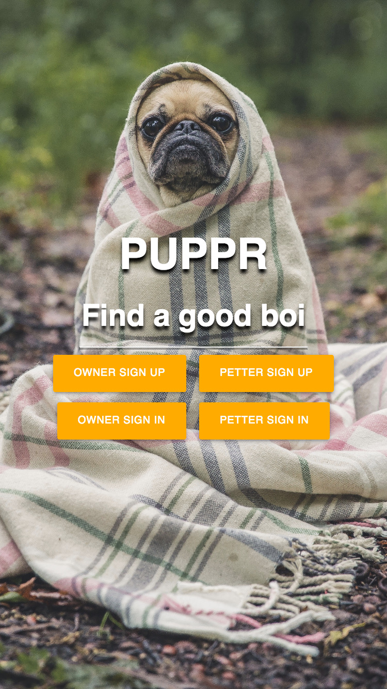
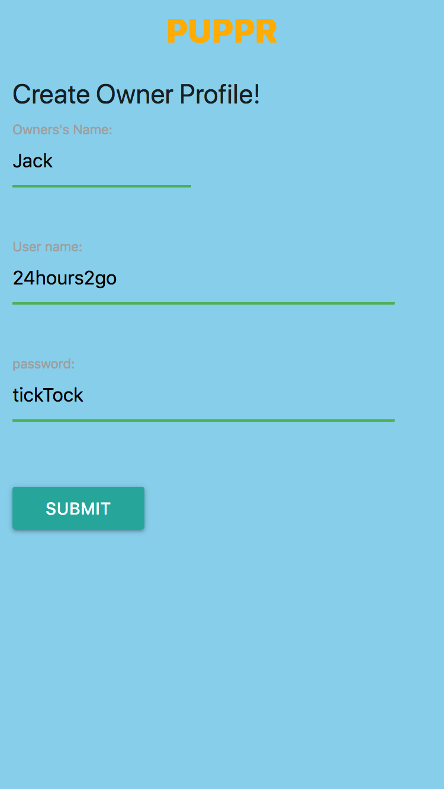
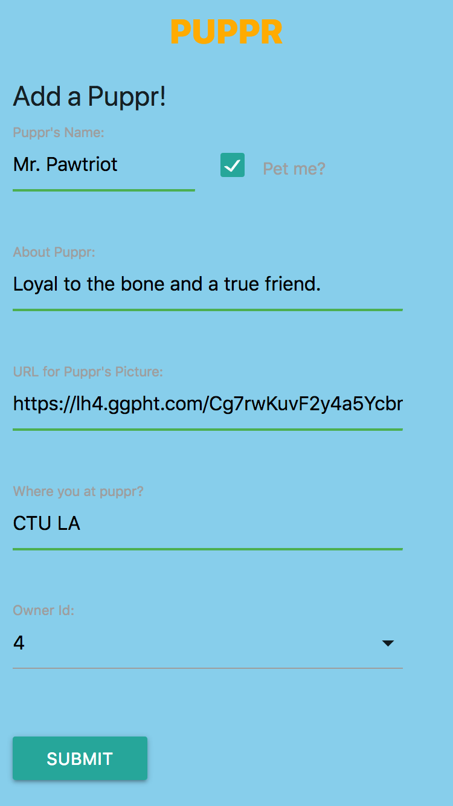

# PUPPR

PUPPR is a mobile first web app with the goal of connecting people looking to pet or play with dogs with dogs available nearby! It was designed with stressed out, bored & lonely people in mind, or just people who love dogs & want to pet ALL THE DOGS!

I also designed it with dog owners in mind. If you are a dog person, you know that you'll cross a busy street if you see a dog over there but there are sadly dogs who don't like to be pet by strangers. So this app helps solve that problem by allowing dog owners to upload their dogs profile & set the dogs to be listed as approachable or not. This shows up on the main view for the petters as a red paw on the dogs profile, giving them the clue that if they see that dog around they shouldn't just run up to it. Happy owners, happy petters & happy pupprs all around!

### Deployed here: http://puppr.surge.sh/
#### Frontend GitHub: https://github.com/ccawley/puppr-frontend
#### Backend GitHub: https://github.com/ccawley/puppr-backend

## Features
- Different signup process for dog owners vs dog petters.
- Main page shows a mini profile for all dogs.
- User can click on a dog's mini profile to get to a detailed view for the dog.

## Technologies
#### Frontend
- HTML5
- CSS3
- JavaScript
- Materialize CSS
- AJAX/axios
- jQuery

#### Backend
- PostgreSQL
- Knex.js
- Node.js
- Express.js
- REST API
- JavaScript

## Screenshots

### Splash page:

### Owner sign up form:

### Owner add a puppr form:

